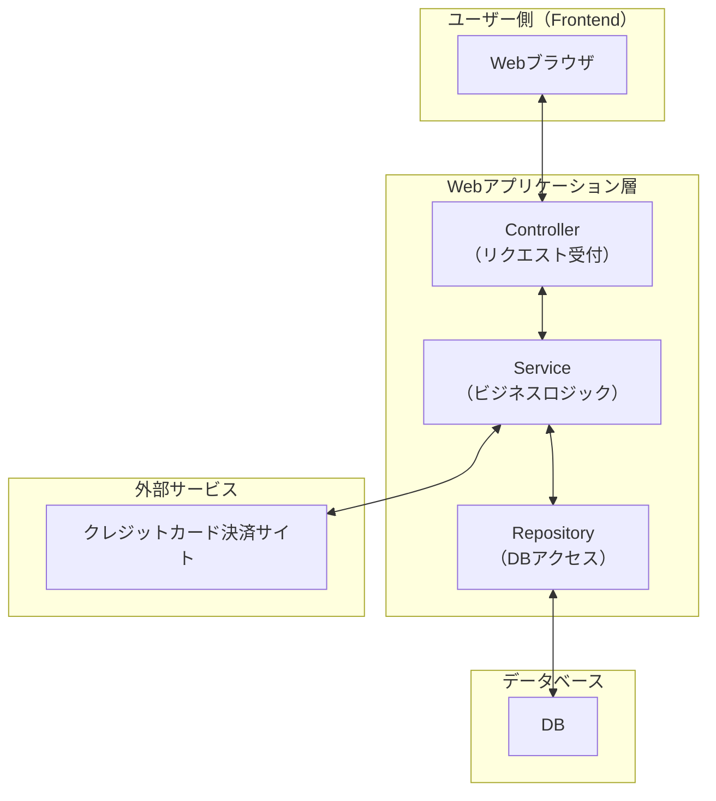

# シンプル雑貨オンライン詳細設計書

※本バージョンは、基本設計の中から必須機能（商品閲覧、カート操作、非会員としての注文確定）の実装に絞った構成としています。

| ドキュメントバージョン | 1.0                                   |
| :------------------- | :------------------------------------ |
| 作成日               | 2025年7月4日                          |
| 作成チーム           | Ace                            |
| 更新履歴             | 2025/04/06: Ver.1.0 初版作成 (チーム〇〇) |

## 1. はじめに

### 1.1. 本書の目的

本書は、「シンプル雑貨オンライン」新規構築プロジェクトにおける詳細設計の内容を定義するものです。基本設計書 Ver.1.0 で定義された内容に基づき、実装担当者がプログラミング作業を迷いなく進められるように、システムの内部構造、処理フロー、インターフェース、データベース構造、画面項目などを具体的に記述します。

### 1.2. 前提となる基本設計書

本書は、以下の基本設計書の内容を前提としています。

- シンプル雑貨オンライン 基本設計書 Ver.1.0

### 1.3. 対象読者

本書は、以下の担当者を対象としています。

- 本システムのバックエンド開発担当者
- 本システムのフロントエンド開発担当者
- 本システムのテスト担当者
- プロジェクト管理者

### 1.4. 参考文献

- シンプル雑貨オンライン 基本設計書 Ver.1.0
- (チーム内で使用するコーディング規約などがあれば記載)

## 2. システム概要

システムの目的、対象ユーザー、全体構成、外部インターフェースについては、基本設計書 Ver.1.0 の「2. システム概要」に記載の通りです。

**システム構成（再掲）**
