# シンプル雑貨オンライン詳細設計書

※本バージョンは、基本設計の中から必須機能（商品閲覧、カート操作、非会員としての注文確定）の実装に絞った構成としています。


| 項目 | 内容 |
| :------------------- | :------------------------------------ |
| ドキュメントバージョン | 1.0                                   |
| 作成日               | 2025年7月8日                          |
| 作成チーム           | Ace                            |
| 更新履歴             | 2025/07/08: Ver.1.0  |

## 1 はじめに

### 1.1 本書の目的

本書は、「シンプル雑貨オンライン」新規構築プロジェクトにおける詳細設計の内容を定義するものです。基本設計書 Ver.1.0 で定義された内容に基づき、実装担当者がプログラミング作業を迷いなく進められるように、システムの内部構造、処理フロー、インターフェース、データベース構造、画面項目などを具体的に記述します。

### 1.2 前提となる基本設計書

本書は、以下の基本設計書の内容を前提としています。

- シンプル雑貨オンライン 基本設計書 Ver.1.0

### 1.3 対象読者

本書は、以下の担当者を対象としています。

- 本システムのバックエンド開発担当者
- 本システムのフロントエンド開発担当者
- 本システムのテスト担当者
- プロジェクト管理者

### 1.4 参考文献

- シンプル雑貨オンライン 基本設計書 Ver.1.0
- (チーム内で使用するコーディング規約などがあれば記載)

## 2 システム概要

システムの目的、対象ユーザー、全体構成、外部インターフェースについては、基本設計書 Ver.1.0 の「2. システム概要」に記載の通りです。

**システム構成（再掲）**
```mermaid
graph TD
 
 
%% ユーザー側
subgraph User["ユーザー側（Frontend）"]
  %% 説明: ユーザーが操作するWebブラウザ。ECサイトにアクセスし、商品を閲覧・購入するUIを提供。
  U1[Webブラウザ]
end
 
%% Webアプリケーション層
subgraph App["Webアプリケーション層"]
  %% Controller: HTTPリクエストを受け付け、レスポンスを返すエンドポイント
  C1[Controller<br/>（リクエスト受付）]
 
  %% Service: ビジネスロジックを実装する層
  S1[Service<br/>（ビジネスロジック）]
 
  %% Repository: データベースアクセスを担当する層
  R1[Repository<br/>（DBアクセス）]
end
 
%% データベース
subgraph DB["データベース"]
  %% 説明: 商品情報、注文履歴、ユーザー情報などを保持する。
  D1[DB]
end
 
%% 外部サイト
subgraph External["外部サービス"]
  %% 説明: クレジットカード決済を処理する外部サービス。
  E1[クレジットカード決済サイト]
end
 
%% 接続
U1 <--> C1
C1 <--> S1
S1 <--> R1
R1 <--> D1
S1 <--> E1
 
```

## 3 機能仕様

### 3.1 機能一覧

本システムが提供する必須機能は以下の通りです

- 商品一覧表示機能 (101,102,103)
- 商品詳細表示機能 (104,105,106,107)
- カート追加 (201)
- カート情報取得 
- カート数量変更 (202)
- カート商品削除 (203)
- 注文機能 (205,206,207)
- 会員登録 (301)

カート情報取得機能に関しては基本設計書で定義していないが詳細設計書で追加

### 3.2　機能詳細

主要機能におけるユーザー操作から始まるフロントエンドとバックエンドAPI間の連携、およびバックエンド内部のクラス間連携の概要をシーケンス図で示します。

#### 3.2.1 商品一覧表示機能 (101,102,103)

ユーザーが商品一覧ページにアクセスした際の処理フローです。

<div class="mermaid">
sequenceDiagram
    participant User
    participant Frontend
    participant ProductController
    participant ProductService
    participant ProductRepository
    participant Product

    User->>Frontend: 商品一覧画面を開く
    Frontend->>ProductController: GET /products
    ProductController->>ProductService: findAllProducts()
    ProductService->>ProductRepository: findAll()
    ProductRepository->>Product: 商品一覧 + 画像取得
    Product-->>ProductRepository: 商品データリスト
    ProductRepository-->>ProductService: List<Product>
    ProductService-->>ProductController: List<Product>
    ProductController-->>Frontend: ResponseEntity<List<Product>>
    Frontend-->>User: 商品一覧を表示

  </div>

#### 3.2.2 商品詳細表示機能 (104,105,106,107)
ユーザーが商品一覧から特定の商品を選択し、詳細ページを表示する際の処理フローです。

<div class="mermaid">
sequenceDiagram
    participant User
    participant Frontend
    participant ProductController
    participant ProductService
    participant ProductRepository
    participant Product

    User->>Frontend: 商品をクリック（商品ID = P001）
    Frontend->>ProductController: GET /products/P001
    ProductController->>ProductService: findProductById("P001")
    ProductService->>ProductRepository: findById("P001")
    ProductRepository->>Product: 商品 + 画像取得
    Product-->>ProductRepository:商品データ(P001)
    ProductRepository-->>ProductService: Product
    ProductService-->>ProductController: Product
    ProductController-->>Frontend: ResponseEntity<Product>
    Frontend-->>User: 商品詳細を表示

</div>


#### 3.2.3 カート追加 (201)
ユーザーがカートに追加ボタンを押した際の処理フローです。
<div class="mermaid">
sequenceDiagram
    participant User
    participant Browser
    participant CartController
    participant SessionManager
    participant CartService
    participant ProductRepository
    participant CartRepository
    participant CartItemRepository
    participant Database

    User->>Browser: カートに商品を追加 (productId, quantity)
    Browser->>CartController: POST /cart/add (CartItemInfo)
    CartController->>SessionManager: getSessionId(HttpRequest)
    SessionManager-->>CartController: sessionIdを返す
    CartController->>CartService: addItemToCart(sessionId, CartItemInfo)

    CartService->>CartRepository: findBySessionId(sessionId)
    alt カートが存在しない場合
        CartRepository-->>CartService: Optional.empty()
        CartService->>CartRepository: save(new Cart())
        CartRepository-->>CartService: 新しいCartエンティティ
        CartService->>Database: 新しいカートを保存
    else カートが存在する場合
        CartRepository-->>CartService: Optional<Cart> (既存のCartエンティティ)
    end

    CartService->>ProductRepository: findById(CartItemInfo.productId)
    ProductRepository-->>CartService: Productエンティティを返す
    CartService->>CartItemRepository: findByCartId(Cart.cartId)
    CartItemRepository-->>CartService: 既存のCartItemリストを返す

    alt 既存のカートアイテムを更新する場合
        CartService->>CartItemRepository: save(updated CartItem)
        CartItemRepository-->>CartService: 更新されたCartItemエンティティ
        CartService->>Database: カートアイテムを更新
    else 新しいカートアイテムを追加する場合
        CartService->>CartItemRepository: save(new CartItem)
        CartItemRepository-->>CartService: 新しいCartItemエンティティ
        CartService->>Database: カートアイテムを追加
    end

    CartService-->>CartController: 更新されたCartエンティティ (またはDto変換されたもの)
    CartController-->>Browser: ResponseEntity<CartDto> (成功レスポンス)
    Browser-->>User: カートに追加された商品とカート情報を表示
</div>


#### 3.2.4 カート情報取得 
ユーザーがカートの情報を取得する際の処理フローです。
<div class="mermaid">
sequenceDiagram
 
    participant User
 
    participant CartController
 
    participant SessionManager
 
    participant CartService
 
    participant CartRepository
 
    participant CartItemRepository
 
    participant ProductRepository
 
    participant CartDto
 
    User ->> CartController: getCart(request)
 
    CartController ->> SessionManager: getSessionId(request)
 
    SessionManager -->> CartController: sessionId
 
    CartController ->> CartService: getOrCreateCart(sessionId)
 
    CartService ->> CartRepository: findBySessionId(sessionId)
 
    alt カートが存在しない
 
        CartService ->> CartRepository: save(new Cart)
 
    end
 
    CartRepository -->> CartService: cart
 
    CartService ->> CartItemRepository: findByCartId(cart.cartId)
 
    CartItemRepository -->> CartService: List<CartItem>
 
    loop 各CartItemに対して
 
        CartService ->> ProductRepository: findById(cartItem.productId)
 
        ProductRepository -->> CartService: Product
 
    end
 
    CartService -->> CartController: Cart (エンティティ)
 
    CartController ->> CartDto: convert Cart + CartItems to CartDto
 
    CartDto -->> CartController: cartDto
 
    CartController -->> User: ResponseEntity<CartDto>
 
</div>


#### 3.2.5 カート数量変更 (202)
ユーザーがカートの数量を変更する際の処理フローです。
<div class="mermaid">
sequenceDiagram
    participant User
    participant Browser
    participant CartController
    participant SessionManager
    participant CartService
    participant CartRepository
    participant CartItemRepository
    participant Database

    User->>Browser: カートアイテムの数量を変更 (cartItemId, quantity)
    Browser->>CartController: PUT /cart/{itemId}/quantity (CartItemQuantityDto)
    CartController->>SessionManager: getSessionId(HttpRequest)
    SessionManager-->>CartController: sessionIdを返す
    CartController->>CartService: updateItemQuantity(sessionId, itemId, quantity)

    CartService->>CartRepository: findBySessionId(sessionId)
    CartRepository-->>CartService: Optional<Cart> (既存のCartエンティティ)

    alt カートが見つからない場合
        CartService-->>CartController: エラー (例: CartNotFoundException)
        CartController-->>Browser: エラーレスポンス (例: 404 Not Found)
        Browser-->>User: エラーメッセージを表示
    else カートが見つかった場合
        CartService->>CartItemRepository: findById(itemId)
        CartItemRepository-->>CartService: Optional<CartItem> (既存のCartItemエンティティ)

        alt カートアイテムが見つからない場合
            CartService-->>CartController: エラー (例: CartItemNotFoundException)
            CartController-->>Browser: エラーレスポンス (例: 404 Not Found)
            Browser-->>User: エラーメッセージを表示
        else カートアイテムが見つかった場合
            CartService->>CartItemRepository: save(updated CartItem)
            CartItemRepository-->>CartService: 更新されたCartItemエンティティ
            CartService->>Database: カートアイテムを更新

            CartService-->>CartController: 更新されたCartエンティティ (またはDto変換されたもの)
            CartController-->>Browser: ResponseEntity<CartDto> (成功レスポンス)
            Browser-->>User: 更新されたカート情報を表示
        end
    end
</div>


#### 3.2.6 カート商品削除 (203)
ユーザーがカートの商品を削除する際の処理フローです。
<div class="mermaid">
 
sequenceDiagram
    participant User
    participant CartController
    participant SessionManager
    participant CartService
    participant CartRepository
    participant CartItemRepository
    participant CartDto
 
    User ->> CartController: removeItem(itemId, request)
    CartController ->> SessionManager: getSessionId(request)
    SessionManager -->> CartController: sessionId
 
    CartController ->> CartService: removeItemFromCart(sessionId, itemId)
   
    CartService ->> CartRepository: findBySessionId(sessionId)
    CartRepository -->> CartService: Cart
 
    CartService ->> CartItemRepository: deleteById(itemId)
 
    CartService ->> CartItemRepository: findByCartId(cart.cartId)
    CartItemRepository -->> CartService: List<CartItem>
 
    loop 各CartItemに対して
        note right of CartService: 商品名や価格のために<br/>ProductRepositoryへ問い合わせ
    end
 
    CartService -->> CartController: Cart（更新後）
 
    CartController ->> CartDto: convert Cart to CartDto
    CartDto -->> CartController: cartDto
 
    CartController -->> User: ResponseEntity<CartDto>
 
</div>
 


#### 3.2.7 注文機能 (205,206,207)
ユーザーが注文確認画面で注文確定を押した際の処理フローです。
<div class="mermaid">

sequenceDiagram

    participant User

    participant Browser

    participant OrderController

    participant HttpSession

    participant CartService

    participant CartRepository

    participant CartItemRepository

    participant OrderService

    participant ProductRepository

    participant OrderRepository

    participant OrderItemRepository

    participant Database
 
    User->>Browser: 注文を確定する (支払い情報、配送先など)

    Browser->>OrderController: POST /orders/placeOrder (OrderRequest)

    OrderController->>HttpSession: getCurrentCartId()

    HttpSession-->>OrderController: cartIdを返す
 
    OrderController->>CartService: getCartByCartId(cartId)

    CartService->>CartRepository: findById(cartId)

    CartRepository-->>CartService: Optional<Cart> (カートエンティティ)

    alt カートが存在しない場合

        CartService-->>OrderController: エラー (例: CartNotFoundException)

        OrderController-->>Browser: エラーレスポンス (例: 404 Not Found)

        Browser-->>User: エラーメッセージを表示

        
    end

    CartService->>CartItemRepository: findByCartId(cartId)

    CartItemRepository-->>CartService: List<CartItem> (カートアイテムリスト)

    CartService-->>OrderController: Cartオブジェクト (CartエンティティとCartItemの関連を含む)
 
    OrderController->>OrderService: placeOrder(cart, OrderRequest)
 
    OrderService->>ProductRepository: getProductDetails(cart.items)

    ProductRepository-->>OrderService: 商品詳細 (価格など)
 
    OrderService->>Order: 新しいOrderエンティティを作成 (Cartの内容とOrderRequestから)

    OrderService->>OrderRepository: save(new Order)

    OrderRepository-->>OrderService: 保存されたOrderエンティティ

    OrderService->>Database: Orderを保存
 
    loop 各CartItemについて

        OrderService->>OrderItem: 新しいOrderItemエンティティを作成

        OrderService->>OrderItemRepository: save(new OrderItem)

        OrderItemRepository-->>OrderService: 保存されたOrderItemエンティティ

        OrderService->>Database: OrderItemを保存

    end
 
    OrderService->>CartService: clearCart(cart.sessionId)

    CartService->>CartItemRepository: deleteByCartId(cart.cartId)

    CartItemRepository-->>CartService: 削除完了

    CartService->>CartRepository: deleteById(cart.cartId)

    CartRepository-->>CartService: 削除完了

    CartService->>Database: カートの内容をクリア
 
    OrderService-->>OrderController: OrderResponse (作成された注文IDなど)

    OrderController-->>Browser: ResponseEntity<OrderResponse> (成功レスポンス)

    Browser-->>User: 注文完了画面へ遷移 (注文IDを表示)
    
 </div>


#### 3.2.8 会員登録 (301)
  ユーザーが会員登録を行う際の処理フローです。
  <div class="mermaid">
sequenceDiagram

    participant User

    participant Browser

    participant CustomerController

    participant CustomerService

    participant PasswordEncoder

    participant CustomerRepository

    participant Database
 
    User->>Browser: 会員登録情報を入力

    Browser->>CustomerController: POST /register (CustomerRequest)

    CustomerController->>CustomerService: registerCustomer(customerRequest)
 
    CustomerService->>CustomerService: generateCustomerId()

    CustomerService-->>CustomerService: customerIdを生成
 
    CustomerService->>PasswordEncoder: encode(customerRequest.password)

    PasswordEncoder-->>CustomerService: 暗号化されたパスワードを返す
 
    CustomerService->>Customer: 新しいCustomerエンティティを作成 (customerRequestと暗号化されたパスワードから)

    CustomerService->>CustomerService: setTimestamps(customer)
 
    CustomerService->>CustomerRepository: save(customer)

    CustomerRepository-->>CustomerService: 保存されたCustomerエンティティ

    CustomerService->>Database: 会員情報を保存
 
    CustomerService-->>CustomerController: 登録完了メッセージ (またはcustomerId)

    CustomerController-->>Browser: 登録成功レスポンス (例: "登録が完了しました")

    Browser-->>User: 登録成功メッセージを表示
 </div>

## 4. クラス設計

ここでは、「シンプル雑貨オンライン」バックエンド（Spring Boot）アプリケーションのクラス構造について定義します。主要なパッケージ構成、クラス図、主要クラスの説明、およびデータ転送オブジェクト（DTO）の定義を示します。

### 4.1. 主要パッケージ構成

ソースコードの整理と見通しを良くするため、以下のようなパッケージ構成を基本とします。ルートパッケージは `com.example.simplezakka` （仮）とします。

```
com.example.simplezakka

├── SimpleZakkaOnlineApplication.java  // Spring Boot起動クラス

│

├── controller      // HTTPリクエスト処理、APIエンドポイント定義

│   ├── ProductController.java

│   ├── CartController.java

│   ├── OrderController.java

│   ├── CustomerController.java

│   └── LoginController.java               

│

├── service         // ビジネスロジック実装

│   ├── ProductService.java

│   ├── CartService.java     

│   ├── OrderService.java

│   ├── CustomerService.java

│   └── LoginService.java                 

│

├── repository      // データベースアクセス (Spring Data JPA)

│   ├── ProductRepository.java

│   ├── CartRepository.java

│   ├── CartItemRepository.java

│   ├── OrderRepository.java

│   ├── OrderItemRepository.java

│   ├── CustomerRepository.java          

│  

│

├── entity          // DBテーブルに対応するJPAエンティティ

│   ├── Product.java

│   ├── Cart.java

│   ├── CartItem.java

│   ├── Order.java

│   ├── OrderItem.java

│   └── Customer.java                   

│

├── dto             // Data Transfer Object (API入出力、レイヤー間データ転送用)

│   ├── product

│   │   ├── ProductListItem.java

│   │   └── ProductDetail.java

│   ├── cart

│   │   ├── CartDto.java         

│   │   └── CartItemDto.java     

│   │   ├── CartItemInfo.java

│   │   └── CartItemQuantityDto.java

│   ├── order

│   │   ├── OrderRequest.java

│   │   ├── CustomerInfo.java

│   │   └── OrderResponse.java

│   └── customer

│       ├── CustomerRequest.java

│       ├── LoginRequest.java         

│       └── CustomerResponse.java       

│

├── exception

│   └── GlobalExceptionHandler.java

│

└── config

    └── DataLoader.java
 
```
 
**補足:**
 
- Service層のインターフェースと実装クラスの分離は不要です。
 
 ### 4.2 クラス図

#### 4.2.1 商品一覧・詳細
 
<div class="mermaid">
classDiagram
    ProductController --> ProductService : uses
    ProductService --> ProductRepository : uses
    ProductRepository -- Product : manages
 
    ProductService ..> ProductDetail : creates
    ProductService ..> ProductListItem : creates
    ProductController ..>ProductDetail : returns
    ProductController ..> ProductListItem : returns
   
 
    class ProductController {
        +ProductService productService
        +getAllProducts():ResponseEntity~List~ProductListItem~~
        +getProductById(String productId):ResponseEntity~ProductDetail~
    }
    class ProductService {
        +ProductRepository productRepository
        +findAllProducts():List<Product>
        +findProductById(String productId):Product
        +updateStock(String productId, int quantityChange):void
    }
    class ProductRepository {
        +JpaRepository~Product, Integer~
        +findAll():List<Product>
        +findById(String productId):Optional<Product>
        +save(Product product):Product
        +updateStockQuantity(String productId, int newQuantity):void
    }
    class Product {
        +String productId
        +String productName
        +String description
        +String material
        +Decimal price
        +string imageurl
        +int stockQuantity
        +LocalDateTime createdAt
        +LocalDateTime updatedAt
    }
   
    class ProductDetail{
        +String productId
        +String productName
        +String description
        +String material
        +Decimal price
        +string imageurl
        +int stockQuantity
       
    }
    class ProductListItem{
        +String productId
        +String productName
        +string imageurl
        +Decimal price
       
    }
</div>
 
 #### 4.2.2 カート機能
 
<div class="mermaid">
classDiagram
 
%% === エンティティ ===
class Cart {
    <<Entity>>
    +cartId: String
    +sessionId: String
    +createdAt: LocalDateTime
    +updatedAt: LocalDateTime
}
 
class CartItem {
    <<Entity>>
    +cartItemId: String
    +cartId: String
    +productId: String
    +quantity: int
    +priceAtAddition: BigDecimal
    +createdAt: LocalDateTime
    +updatedAt: LocalDateTime
}
 
 
%% === DTO / 入力モデル ===
class CartDto {
    +cartId: String
    +items: List~CartItemDto~
    +totalPrice: BigDecimal
}
 
class CartItemDto {
    +productId: String
    +name: String
    +quantity: int
    +price: BigDecimal
}
 
class CartItemInfo {
    +productId: String
    +quantity: int
}
 
class CartItemQuantityDto {
    +quantity: int
}
 
%% === コントローラ層 ===
class CartController {
    -cartService: CartService
    -sessionManager: SessionManager
    +getCart(request: HttpRequest): ResponseEntity~CartDto~
    +addItem(itemInfo: CartItemInfo, request: HttpRequest): ResponseEntity~CartDto~
    +updateItem(itemId: String, quantityDto: CartItemQuantityDto, request: HttpRequest): ResponseEntity~CartDto~
    +removeItem(itemId: String, request: HttpRequest): ResponseEntity~CartDto~
}
 

class SessionManager {
    +getSessionId(request: HttpRequest): String
}
 
%% === サービス層 ===
class CartService {
    -cartRepository: CartRepository
    -cartItemRepository: CartItemRepository
    -productRepository: ProductRepository
    +getOrCreateCart(sessionId: String): Cart
    +addItemToCart(sessionId: String, cartItemInfo: CartItemInfo): Cart
    +updateItemQuantity(sessionId: String, itemId: String, quantity: int): Cart
    +removeItemFromCart(sessionId: String, itemId: String): Cart
}
 
%% === Repository層 ===
class CartRepository {
    -jpaRepository: JpaRepository~Cart, String~
    +findBySessionId(sessionId: String): Optional~Cart~
    +findById(cartId: String): Optional~Cart~
    +save(cart: Cart): Cart
}
 
class CartItemRepository {
    -jpaRepository: JpaRepository~CartItem, String~
    +findByCartId(cartId: String): List~CartItem~
    +save(cartItem: CartItem): CartItem
    +deleteById(cartItemId: String): void
    +deleteByCartId(cartId: String): void
}
 
 
 
%% === 関係 ===
CartController --> SessionManager : uses
CartController --> CartService : uses
CartController ..> CartDto : returns
CartController ..> CartItemInfo : receives
CartController ..> CartItemQuantityDto : receives
CartController ..> HttpRequest : receives
 
CartService --> CartRepository : uses
CartService --> CartItemRepository : uses
CartService --> ProductRepository : uses
 
CartRepository ..> Cart : manages
CartItemRepository ..> CartItem : manages
 
 
Cart "1" -- "*" CartItem : contains
CartDto "1" -- "*" CartItemDto : contains
 
 
</div>
 
#### 4.2.3 注文処理

<div class="mermaid">
classDiagram
 
%% === Controller & Service ===
class OrderController {
    +OrderService orderService
    +CartService cartService
    +placeOrder(orderRequest: OrderRequest, session: HttpSession): ResponseEntity~OrderResponse~
}
 
class OrderService {
    +OrderRepository orderRepository
    +OrderItemRepository orderItemRepository
    +ProductRepository productRepository
    +CartService cartService
    +placeOrder(cart: Cart, orderRequest: OrderRequest): OrderResponse
}
 
%% === Repository ===
class OrderRepository {
    <<Interface>>
    +JpaRepository~Order, String~
}
 
class OrderItemRepository {
    <<Interface>>
    +JpaRepository~OrderItem, String~
}
 
%% === Entity ===
class Order {
    <<Entity>>
    +String orderId
    +String customerId  // nullable（会員用）
    +String guestName
    +String guestEmail
    +String guestShippingAddress
    +String guestPhoneNumber
    +Decimal totalAmount
    +Decimal shippingFee
    +LocalDateTime orderDate
    +String orderStatus
}
 
class OrderItem {
    <<Entity>>
    +String orderItemId
    +String orderId
    +String productId
    +int quantity
    +BigDecimal itemPrice
}
 
 
 
%% === DTO ===
class OrderRequest {
    <<DTO>>
    +CustomerInfo customerInfo
}
 
class CustomerInfo {
    <<DTO>>
    +String name
    +String email
    +String address
    +String phoneNumber
}
 
class OrderResponse {
    <<DTO>>
    +String orderId
    +LocalDateTime orderDate
}
 
%% === 関係 ===
OrderController --> OrderService : uses
OrderController --> CartService : uses
OrderService --> OrderRepository : uses
OrderService --> OrderItemRepository : uses
OrderService --> ProductRepository : uses
OrderService --> CartService : uses
 
OrderRepository "1" -- "*" Order : manages
OrderItemRepository "1" -- "*" OrderItem : manages
Order "1" -- "*" OrderItem : contains (Cascade PERSIST/MERGE)
OrderItem "n" -- "1" Order : belongs to
OrderItem "*" --> "1" Product : refers to
 
OrderController ..> OrderRequest : receives
OrderController ..> OrderResponse : returns
OrderService --> OrderResponse : creates
</div>
 
 #### 4.2.4 会員機能

<div class="mermaid">
classDiagram
 
%% === Controller層 ===
class CustomerController {
    +CustomerService customerService
    +register(customerRequest: CustomerRequest): String
}
 
%% === Service層 ===
class CustomerService {
    +CustomerRepository customerRepository
    +registerCustomer(customerRequest: CustomerRequest): String
    -passwordEncoder: PasswordEncoder
    -generateCustomerId(): String
    -setTimestamps(customer: Customer): void
}
 
%% === Repository層 ===
class CustomerRepository {
    <<Interface>>
    +JpaRepository~Customer, String~
}
 
%% === Entity層 ===
class Customer {
    <<Entity>>
    +String customerId
    +String customerName
    +String email
    +String password
    +String shippingAddress
    +String phoneNumber
    +LocalDateTime createdAt
}
 
%% === DTO層 ===
class CustomerRequest {
    <<DTO>>
    +String customerName
    +String email
    +String password
    +String shippingAddress
    +String phoneNumber
}
 
%% === 関係 ===
CustomerController --> CustomerService : uses
CustomerService --> CustomerRepository : uses
CustomerService ..> CustomerRequest : receives
CustomerRepository ..> Customer : manages
CustomerController ..> CustomerRequest : receives
 
</div>

#### 4.2.5 ログイン機能

<div class="mermaid">
 
classDiagram
    %% Controller → Service → Repository の3層構造
    LoginController --> LoginService : uses
    LoginService --> CustomerRepository : uses
    CustomerRepository -- Customer : manages
    LoginService ..> CustomerResponse : creates
    LoginController ..> LoginRequest : receives
    LoginController ..> CustomerResponse : returns
 
    %% Controller
    class LoginController {
        +LoginService loginService
        +login(LoginRequest): ResponseEntity~CustomerResponse~
    }
 
    %% Service
    class LoginService {
        +CustomerRepository customerRepository
        +login(String email, String password): CustomerResponse
    }
 
    %% Repository
    class CustomerRepository {
        +findByEmail(String email): Optional~Customer~
    }
 
    %% Entity
    class Customer {
        +String customerId
        +String customerName
        +String email
        +String password
        +String shippingAddress
        +String phoneNumber
        +LocalDateTime createdAt
    }
 
    %% DTO
    class LoginRequest {
        <<DTO>>
        +String email
        +String password
    }
 
    class CustomerResponse {
        <<DTO>>
        +String customerName
        +String shippingAddress
        +String phoneNumber
    }
 
</div>
 

### 4.3　主要クラス説明

各レイヤーのクラスの役割と、シンプル雑貨オンラインにおける代表的なクラス名は以下の通りです。
 
- **Controller (`@RestController`)**: フロントエンドからのHTTPリクエストを受け付け、Serviceを呼び出し、結果をJSON形式で返す責務を持ちます。URLルーティング、リクエストデータの受け取りと基本的なバリデーション、レスポンスの生成を担当します。

- **Service (`@Service`)**: アプリケーションのビジネスロジックを実装する責務を持ちます。Controllerから依頼を受け、必要に応じて複数のRepositoryを操作し、結果をControllerに返します。基本的なトランザクション管理も主にこの層で行います。

- **Repository (`@Repository`)**: データベースへのアクセス（基本的なCRUD操作）を担当するインターフェースです。Spring Data JPAを利用し、`JpaRepository`を継承することで基本的なDB操作メソッドが提供されます。複雑なクエリの利用は最小限に留めます。

- **Entity (`@Entity`)**: データベースのテーブル構造にマッピングされるJavaオブジェクトです。テーブルのカラムに対応するフィールドを持ち、JPAのアノテーションが付与されます。

- **DTO (Data Transfer Object)**: レイヤー間（特にControllerとService、APIの境界）でデータを転送するためのオブジェクトです。APIのリクエスト/レスポンス形式の定義にも使用されます。
  

### 4.4. DTO定義
 
主要なAPIや機能で使用されるDTOの構造を示します。 (バリデーションルールは簡略化)
 

**商品関連 DTO**
 
```java
// 商品一覧用
public class ProductListItem {
    private Integer productId;
    private String name;
    private Integer price;
    private String imageUrl;
    // getters, constructor
}
 
// 商品詳細用
public class ProductDetail {
    private String productId;
    private String productName;
    private String description;
    private String material;
    private BigDecimal price;
    private String imageUrl;
    private int stockQuantity;
    // getters, constructor
}
```

**カート関連 DTO**
 
```java
// カート全体 (セッション格納/APIレスポンス用)
public class CartDto {
    private String cartId;
    private int totalQuantity;
    private int totalPrice;
    // メソッド: addItem, updateQuantity, removeItem, calculateTotals など
    // getters
}
 
// カート内商品 (セッション格納/APIレスポンス用)
public class CartItemDto {
    private String productId;
    private String name;
    private Decimal price;
    private int quantity;
    // getters, setters, constructor
}
 
// カート追加APIリクエスト用
public class CartItemInfo {
    @NotNull
    private String productId;
    @NotNull @Min(1)
    private Integer quantity;
    // getters, setters
}
 
// カート数量更新APIリクエスト用
public class CartItemQuantityDto {
    @NotNull @Min(1)
    private Integer quantity;
    // getters, setters
}
```


**注文関連 DTO** 
```java
// 注文APIリクエスト用
public class OrderRequest {
    @Valid // ネストしたDTOのバリデーションを有効化
    @NotNull
    private CustomerInfo customerInfo;
    // getters, setters
}
 
// 注文APIリクエスト内の顧客情報用 (非会員用)
public class CustomerInfo {
    @NotBlank
    private String name;
    @NotBlank @Email
    private String email;
    @NotBlank
    private String address;
    @NotBlank
    private String phoneNumber;
    // getters, setters
}
 
// 注文APIレスポンス用
public class OrderResponse {
    private String orderId;
    private LocalDateTime orderDate;
    // getters, constructor
}
```

**新規会員登録関連 DTO**
``` java
// 顧客情報登録APIリクエスト用
public class CustomerRequest {
    @NotBlank
    private String customerName;
    @Email
    @NotBlank
    private String email;
    @Size(min = 8)
    private String password;
    @NotBlank
    private String shippingAddress;
```

**ログイン関連 DTO**
``` java
// ログイン情報APIリクエスト用
public class LoginRequest{
  @email
  @NotBlank
  private String email;
  @size(min=8)
  private String password;
}
 
// ログイン情報APIレスポンス用
public class CustomerReaponse{
  public String customerName;
  public String shippingAddress;
  public String phoneNumber;
}
 
 
```
 
 
**補足:**
 
- 上記DTOには、基本的なバリデーションのためのアノテーション (`@NotNull`, `@NotBlank`, `@Email`, `@Min`, `@Valid`) を付与しています。Controller層での入力チェックに使用されます。
- コンストラクタやGetter/Setterは記述を省略していますが、実際には必要です（Lombokライブラリの使用も可）。

 

## 5 インターフェース仕様
### 5.1 API一覧

---
 
#### 商品一覧・詳細
 
| 機能概要       | エンドポイントURL     | HTTPメソッド | 備考                                            |
| :------------- | :-------------------- | :----------- | :---------------------------------------------- |
| **全商品一覧取得** | `/api/products`       | `GET`        | 商品の概要（ID、名前、画像URL、価格）を一覧で取得します。 |
| **商品詳細取得** | `/api/products/{id}` | `GET`        | 指定された商品IDの詳細情報（ID、名前、説明、素材、価格、画像URL、在庫数）を取得します。 |
 
---
 
#### カート機能
 
| 機能概要               | エンドポイントURL           | HTTPメソッド | 備考                                                       |
| :--------------------- | :-------------------------- | :----------- | :--------------------------------------------------------- |
| **カート内容取得** | `/api/cart`                 | `GET`        | 現在のセッションのカート内容（カートID、アイテムリスト、合計金額）を取得します。 |
| **カートに商品追加** | `/api/cart/add`             | `POST`       | カートに指定された商品（productId, quantity）を追加します。 |
| **カート商品の数量変更** | `/api/cart/{itemId}/quantity` | `PUT`        | 指定されたカートアイテムの数量を変更します。               |
| **カートから商品削除** | `/api/cart/{itemId}`        | `DELETE`     | 指定されたカートアイテムを削除します。                     |
 
---
 
#### 注文処理
 
| 機能概要   | エンドポイントURL | HTTPメソッド | 備考                                                       |
| :--------- | :---------------- | :----------- | :--------------------------------------------------------- |
| **注文確定** | `/api/orders/placeOrder` | `POST`       | 現在のカート内容と顧客情報（OrderRequest）に基づいて注文を確定します。注文確定後、カートはクリアされます。 |
 
---
 
#### 会員機能
 
| 機能概要   | エンドポイントURL         | HTTPメソッド | 備考                                       |
| :--------- | :------------------------ | :----------- | :----------------------------------------- |
| **会員登録** | `/api/customers/register` | `POST`       | 新規会員情報を登録します。パスワードは安全に暗号化されます。 |
 
---

### 5.2 API詳細


 
#### 5.2.1 商品一覧・詳細
 
#### 全商品一覧取得
 
- **URL**: `/api/products`
- **HTTPメソッド**: `GET`
- **機能概要**: 商品の概要を一覧で取得します。
- **リクエスト**: なし
- **レスポンス**:
  - **成功**: `200 OK`
 
    ```json
    [
      {
        "productId": "string",
        "productName": "string",
        "imageUrl": "string",
        "price": 0.00
      }
    ]
    ```
 
    - **ProductListItem DTO**:
      - `productId`: 商品ID (String)
      - `productName`: 商品名 (String)
      - `imageUrl`: 商品画像のURL (String)
      - `price`: 価格 (BigDecimal)
 
  - **エラー**: `500 Internal Server Error`
 
    ```json
    {
      "timestamp": "2025-07-07T18:30:00.000+09:00",
      "status": 500,
      "error": "Internal Server Error",
      "message": "An unexpected error occurred.",
      "path": "/api/products"
    }
    ```
 
---
 
####  商品詳細取得
 
- **URL**: `/api/products/{id}`
- **HTTPメソッド**: `GET`
- **機能概要**: 指定された商品IDの詳細情報を取得します。
- **パスパラメータ**:
  - `id`: 商品ID (例: `/api/products/P001`)
- **レスポンス**:
  - **成功**: `200 OK`
 
    ```json
    {
      "productId": "string",
      "productName": "string",
      "description": "string",
      "material": "string",
      "price": 0.00,
      "imageUrl": "string",
      "stockQuantity": 0
    }
    ```
 
    - **ProductDetail DTO**:
      - `productId`: 商品ID
      - `productName`: 商品名
      - `description`: 商品説明
      - `material`: 素材
      - `price`: 価格
      - `imageUrl`: 商品画像のURL
      - `stockQuantity`: 在庫数
 
  - **エラー**:
    - `404 Not Found`
 
      ```json
      {
        "timestamp": "2025-07-07T18:30:00.000+09:00",
        "status": 404,
        "error": "Not Found",
        "message": "Product with ID 'PXXX' not found.",
        "path": "/api/products/PXXX"
      }
      ```
 
    - `500 Internal Server Error`
 
---
 
#### 5.2.3 カート機能
 
#### カート内容取得
 
- **URL**: `/api/cart`
- **HTTPメソッド**: `GET`
- **機能概要**: 現在のセッションのカート内容を取得します。
- **レスポンス**:
  - **成功**: `200 OK`
 
    ```json
    {
      "cartId": "string",
      "items": [
        {
          "productId": "string",
          "name": "string",
          "quantity": 0,
          "price": 0.00
        }
      ],
      "totalPrice": 0.00
    }
    ```
 
    - **CartDto DTO**:
      - `cartId`: カートID
      - `items`: List<CartItemDto>
        - `productId`, `name`, `quantity`, `price`
      - `totalPrice`: 合計金額
 
  - **エラー**:
    - `404 Not Found` または `500 Internal Server Error`
 
---
 
#### カートに商品追加
 
- **URL**: `/api/cart/add`
- **HTTPメソッド**: `POST`
- **リクエストボディ**:
 
    ```json
    {
      "productId": "string",
      "quantity": 0
    }
    ```
 
- **レスポンス**: 成功時 `200 OK`（2.1と同様の形式）
 
- **エラー**:
  - `400 Bad Request`:
    ```json
    {
      "message": "Validation failed: quantity must be positive."
    }
    ```
  - `404 Not Found`, `500 Internal Server Error`
 
---
 
#### カート商品の数量変更
 
- **URL**: `/api/cart/{itemId}/quantity`
- **HTTPメソッド**: `PUT`
- **リクエストボディ**:
 
    ```json
    {
      "quantity": 0
    }
    ```
 
- **レスポンス**: 成功時 `200 OK`（2.1と同様の形式）
 
- **エラー例**（`404`）:
 
    ```json
    {
      "message": "Cart item with ID 'CIXXX' not found in your cart."
    }
    ```
 
---
 
#### カートから商品削除
 
- **URL**: `/api/cart/{itemId}`
- **HTTPメソッド**: `DELETE`
- **レスポンス**: 成功時 `200 OK`（2.1と同様）
 
---
 
#### 5.2.3 注文処理
 
#### 注文確定
 
- **URL**: `/api/orders/placeOrder`
- **HTTPメソッド**: `POST`
- **リクエストボディ**:
 
    ```json
    {
      "customerInfo": {
        "name": "string",
        "email": "string",
        "address": "string",
        "phoneNumber": "string"
      }
    }
    ```
 
- **レスポンス**:
 
    ```json
    {
      "orderId": "string",
      "orderDate": "2025-07-07T18:30:00"
    }
    ```
 
- **エラー例（409 Conflict）**:
 
    ```json
    {
      "message": "Product 'P001' is out of stock or quantity is insufficient."
    }
    ```
 
---
 
#### 5.2.4 会員機能
 
#### 会員登録
 
- **URL**: `/api/customers/register`
- **HTTPメソッド**: `POST`
- **リクエストボディ**:
 
    ```json
    {
      "customerName": "string",
      "email": "string",
      "password": "string",
      "shippingAddress": "string",
      "phoneNumber": "string"
    }
    ```
 
- **レスポンス**:
 
    ```json
    {
      "message": "Registration successful.",
      "customerId": "string"
    }
    ```
 
- **エラー**: `400`, `409`, `500`
 
---


## 6 データベース定義

### 6.1 テーブル定義書・index一覧


 
#### CUSTOMER（顧客）
 
| 論理名             | 項目名         | データ型  | PK | FK | index | NULL許容 |
|------------------|--------------|---------|----|----|-------|----------|
| 顧客ID           | customer_id  | string  | ●  |    |  ●     | ×         |
| 氏名             | customer_name| string  |    |    |       | ×        |
| メールアドレス   | email        | string  |    |    |  ○     | ×        |
| パスワード（ハッシュ化） | password     | string  |    |    |       | ×        |
| 配送先住所       | shipping_address | string |    |    |       | ×        |
| 電話番号         | phone_number | string  |    |    |       | ×        |
| 登録日時         | created_at   | datetime|    |    |       | ×        |
| 更新日時         | updated_at   | datetime|    |    |       | ×        |
 
（●: 対象, ○: 作成検討)
 
---
 
#### PRODUCT（商品）
 
| 論理名         | 項目名          | データ型  | PK | FK | index | NULL許容 |
|--------------|---------------|---------|----|----|-------|----------|
| 商品ID       | product_id    | string  | ●  |    |   ●    | ×        |
| 商品名       | product_name  | string  |    |    |  ○     | ×        |
| 商品説明     | description   | text    |    |    |       | ○        |
| 素材         | material      | text    |    |    |       | ○        |
| 価格         | price         | decimal |    |    |       | ×        |
| 在庫数       | stock_quantity| integer |    |    |       | ×        |
| 画像URL      | image_url     | string  |    |    |       | ×        |
| 登録日時     | created_at    | datetime|    |    |       | ×        |
| 更新日時     | updated_at    | datetime|    |    |       | ×        |
 
（●: 対象, ○: 作成検討)
 
---
 
#### ORDER（注文）
 
| 論理名             | 項目名                | データ型  | PK | FK | index | NULL許容 |
|------------------|---------------------|---------|----|----|-------|----------|
| 注文ID           | order_id             | string  | ●  |    |   ●    | ×        |
| 顧客ID（会員の場合） | customer_id          | string  |    | ●  |  ○     |  ○       |
| 購入者氏名（非会員） | guest_name           | string  |    |    |       | ×        |
| 購入者メールアドレス（非会員） | guest_email    | string  |    |    |       | ×        |
| 配送先住所（非会員） | guest_shipping_address | string|    |    |       | ×        |
| 電話番号（非会員）   | guest_phone_number    | string  |    |    |       | ×        |
| 合計金額         | total_amount          | decimal |    |    |       | ×        |
| 送料             | shipping_fee          | string  |    |    |       | ×        |
| 注文日時         | order_date            | datetime|    |    |       | ×        |
| 注文ステータス   | order_status          | string  |    |    |       | ×        |
 
（●: 対象, ○: 作成検討)
 
---
 
#### ORDER_ITEM（注文明細）
 
| 論理名             | 項目名         | データ型  | PK | FK | index | NULL許容 |
|------------------|--------------|---------|----|----|-------|----------|
| 注文明細ID       | order_item_id | string  | ●  |    |  ●     | ×        |
| 注文ID           | order_id     | string  |    | ●  |    ○   | ×        |
| 商品ID           | product_id   | string  |    | ●  |     ○  | ×        |
| 数量             | quantity     | int     |    |    |       | ×        |
| 商品単価（注文時の価格） | item_price | decimal |    |    |       | ×        |
 
（●: 対象, ○: 作成検討)
 
---
 
#### CART（カート）
 
| 論理名                 | 項目名       | データ型  | PK | FK | index | NULL許容 |
|----------------------|------------|---------|----|----|-------|----------|
| カートID             | cart_id    | string  | ●  |    |   ●    | ×        |
| セッションID（ユーザー識別） | session_id | string  |    |    |       | ×        |
| 作成日時             | created_at | datetime|    |    |       | ×        |
| 更新日時             | updated_at | datetime|    |    |       | ×        |
 
（●: 対象, ○: 作成検討)
 
---
 
#### CART_ITEM（カート明細）
 
| 論理名         | 項目名        | データ型 | PK | FK | index | NULL許容 |
|--------------|-------------|--------|----|----|-------|----------|
| カート明細ID | cart_item_id| string | ●  |    |   ●    | ×        |
| カートID     | cart_id    | string |    | ●  |     ○  | ×        |
| 商品ID       | product_id | string |    | ●  |      ○ | ×        |
| 数量         | quantity   | int    |    |    |       | ×        |
 
（●: 対象, ○: 作成検討)


### 6.2　ER図

<div class="mermaid">
erDiagram
    CUSTOMER ||--o{ ORDER : "places"
    ORDER ||--o{ ORDER_ITEM : "contains"
    PRODUCT ||--o{ ORDER_ITEM : "included_in"
    PRODUCT ||--o{ CART_ITEM : "has"
    CART ||--o{ CART_ITEM : "contains"
    
    CUSTOMER {
        string customer_id PK "顧客ID（会員登録者）"
        string customer_name "氏名"
        string email "メールアドレス"
        string password "パスワード（ハッシュ化）"
        string shipping_address "配送先住所"
        string phone_number "電話番号"
        datetime created_at "登録日時"
    }

    PRODUCT {
        string product_id PK "商品ID"
        string product_name "商品名"
        text description "商品説明"
        text material "素材"
        decimal price "価格"
        int stock_quantity "在庫数"
        string image_url "商品画像"
        datetime created_at "登録日時"
        datetime updated_at "更新日時"
        
    }

    

    ORDER {
        string order_id PK "注文ID"
        string customer_id FK "顧客ID（会員の場合）" 
        string guest_name "購入者氏名（非会員）"
        string guest_email "購入者メールアドレス（非会員）"
        string guest_shipping_address "配送先住所（非会員）"
        string guest_phone_number "電話番号（非会員）"
        decimal total_amount "合計金額"
        string shipping_fee "送料"
        datetime order_date "注文日時"
        string order_status "注文ステータス"
    }

    ORDER_ITEM {
        string order_item_id PK "注文明細ID"
        string order_id FK "注文ID"
        string product_id FK "商品ID"
        int quantity "数量"
        decimal item_price "商品単価（注文時の価格）"
    }

    CART {
        string cart_id PK "カートID"
        string session_id "セッションID（ユーザー識別）"
        datetime created_at "作成日時"
        datetime updated_at "更新日時"
    }

    CART_ITEM {
        string cart_item_id PK "カート明細ID"
        string cart_id FK "カートID"
        string product_id FK "商品ID"
        int quantity "数量"
    }
</div>

**エンティティ一覧**
- CUSTOMER
- ORDER
- ORDER_ITEM
- PRODUCT
- CART
- CART_ITEM
 
**リレーションと関係性**
- CUSTOMER — ORDER（1対多）
会員は複数の注文を行うことができる。非会員注文はcustomer_idがNULLとなる。
 
- ORDER — ORDER_ITEM（1対多）
1つの注文は複数の注文明細を含む。注文明細ごとに商品と数量を管理。
 
- PRODUCT — ORDER_ITEM（1対多）
1つの商品は多くの注文明細に含まれ得る。
 
 
- CART — CART_ITEM（1対多）
1つのカートに複数の商品が入ることができる。
 
- PRODUCT — CART_ITEM（1対多）
1つの商品は複数のカート明細に含まれる場合がある。

### 6.3 トランザクション設計方針

以下にユースケースごとのトランザクション境界を示す。
| No. | ユースケース   | トランザクション開始の処理      | トランザクション終了の処理                 |
| --- | -------- | ------------------ | ----------------------------- |
| 1   | 会員登録（新規） | 会員情報のバリデーション       | 会員情報の INSERT                  |
| 2   | ログイン     | 認証用 SELECT（ユーザー検索） | 認証結果の判定                       |
| 3   | カートに商品追加 | カート情報の取得または作成      | カートへの商品 INSERT                |
| 4   | 注文確定     | カート情報の取得           | 注文情報の INSERT、在庫の UPDATE、カート削除 |
 
## 7 画面項目定義

### 7.1 画面一覧

| 画面ID | 画面名       | 概要                              | 機能ID            | 備考          |
| ---- | --------- | ------------------------------- | --------------- | ----------- |
| S001 | 商品一覧画面    | 商品の一覧を表示し、詳細画面への遷移が可能           | 101/102/103     | トップページを兼ねる |
| S002 | 商品詳細画面    | 選択した商品の詳細情報を表示                  | 104/105/106/107 | カート追加ボタンあり  |
| S003 | カート画面     | カートに追加した商品の確認・数量変更が可能           | 201/202/203/204 | 商品削除・合計金額表示 |
| S004 | ログイン画面    | 購入時に会員ログイン情報の入力を行う画面            | 302             |             |
| S005 | ログイン完了画面  | ログイン完了後に遷移する画面                  | 302             |             |
| S006 | 購入者情報入力画面 | ログインをしないユーザーが注文のための購入者情報を入力する画面 | 205             | バリデーションあり   |
| S007 | 注文確認画面    | 入力内容及び注文内容の最終確認を行う画面            | 206             |             |
| S008 | 注文完了画面    | 注文完了メッセージを表示する画面                | 207             |             |
| S009 | 会員登録画面    | 会員情報の入力および登録を行う画面               | 301             |             |
| S010 | 会員登録完了画面  | 会員登録の完了メッセージを表示する画面             | 301             |             |


 
---

| No. | 対象画面ID    | 対象画面名     | 変更内容              | 備考               |
| --- | --------- | --------- | ----------------- | ---------------- |
| 1   | S004      | ログイン画面    | エラーメッセージの追加       | 入力バリデーション対応      |
| 2   | S006      | 購入者情報入力画面 | エラーメッセージの追加       | 既存バリデーションに対応強化   |
| 3   | S009      | 会員登録画面    | エラーメッセージの追加       | 入力必須項目の明確化       |
| 4   | S001〜S010 | 全体        | スマートフォン対応レイアウトを追加 | レスポンシブデザイン対応     |
| 5   | S007      | 注文確認画面    | キャンセル機能を追加        | 確認画面からのキャンセル操作対応 |


**S001　商品一覧画面**
PC
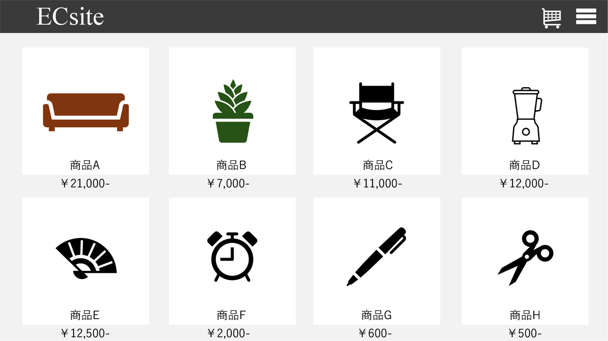
スマホ
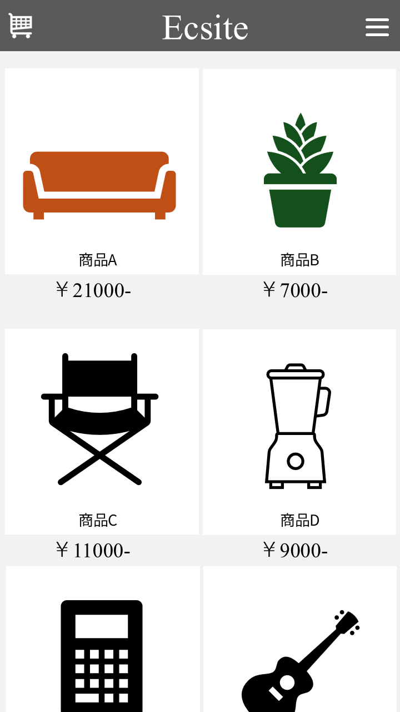

**S002　商品詳細画面**
PC
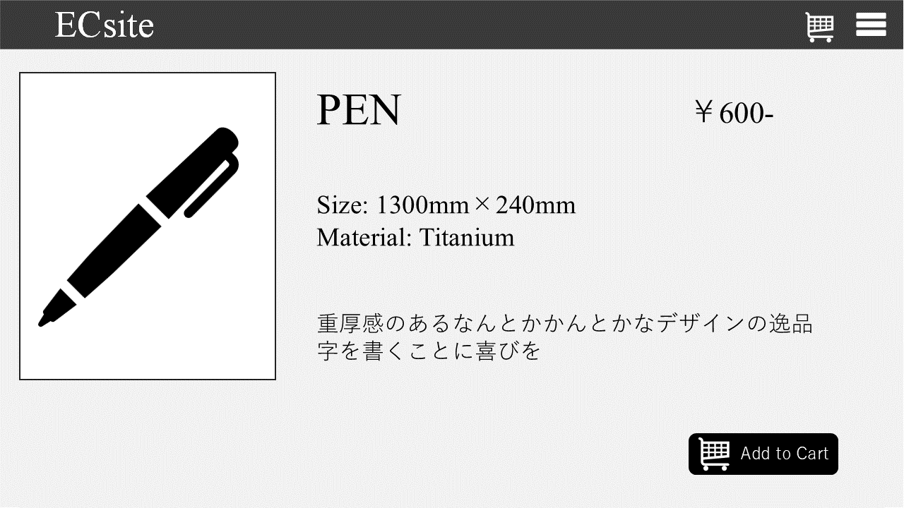
スマホ
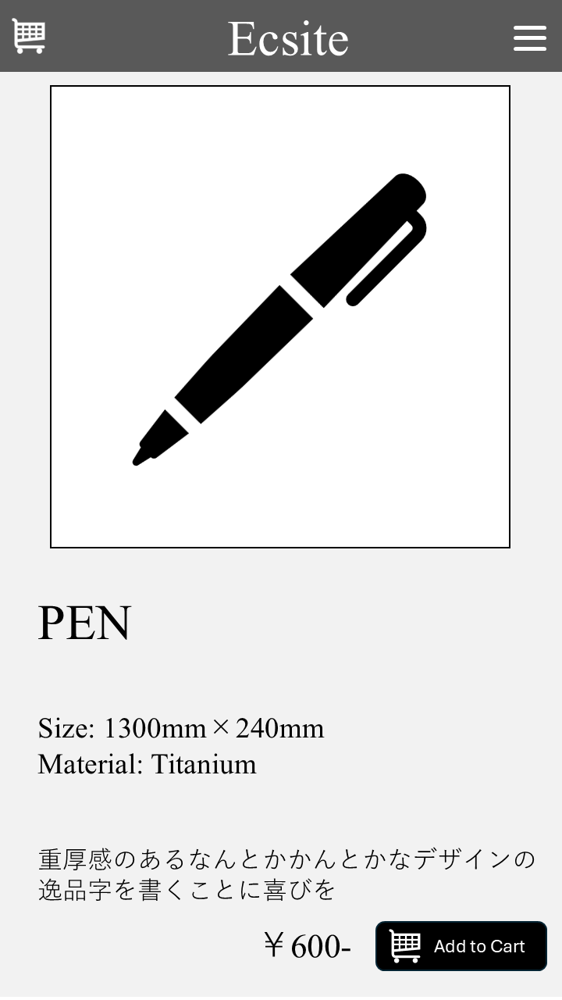
**S003　カート画面**
PC
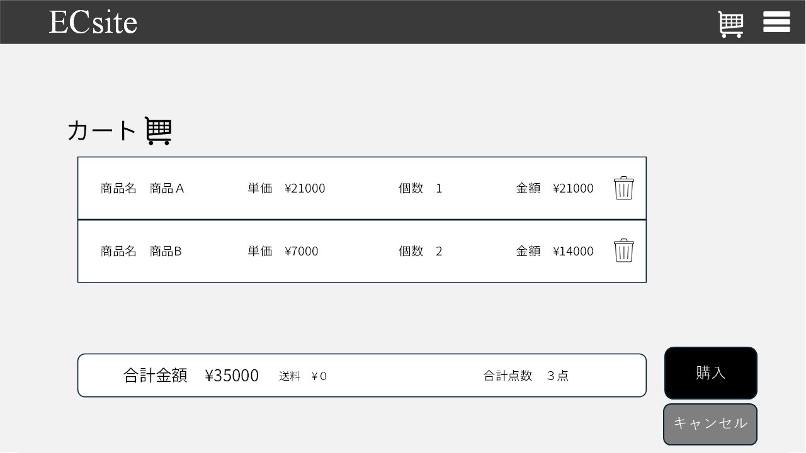
スマホ
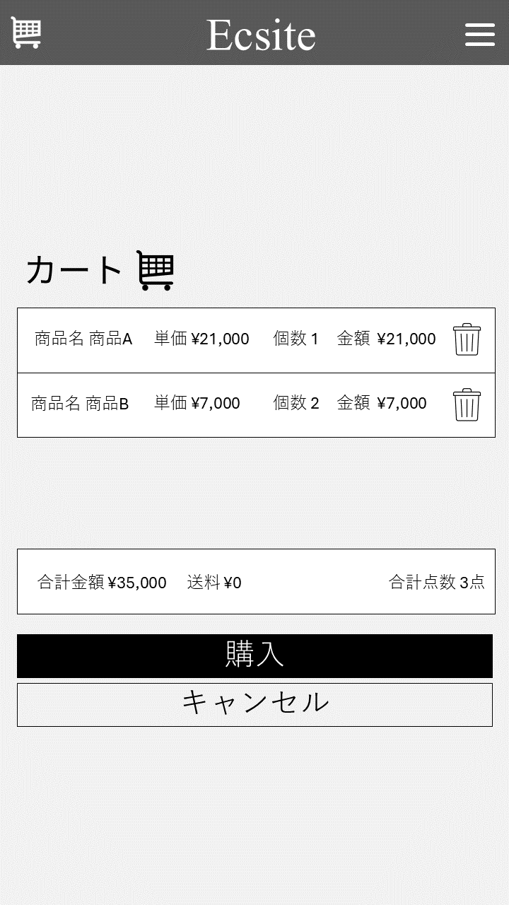

**S004　ログイン画面**
PC
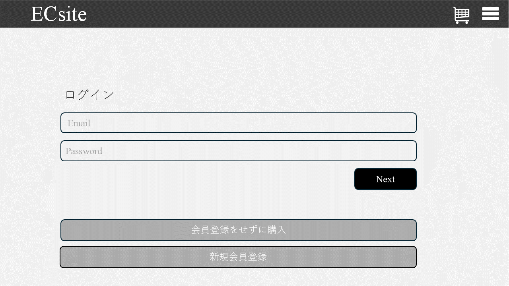
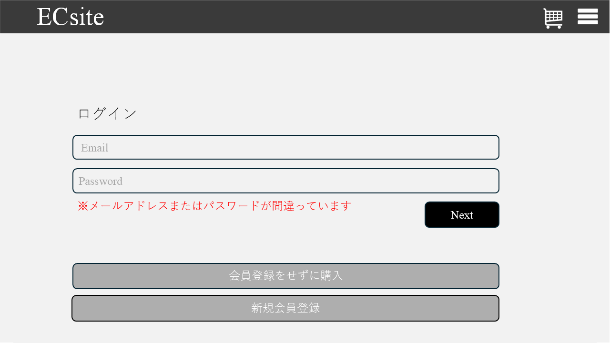
スマホ
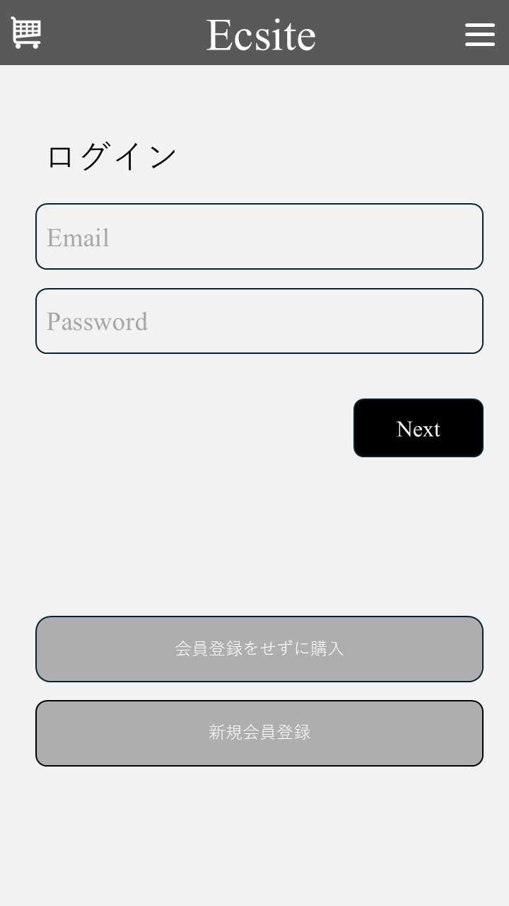
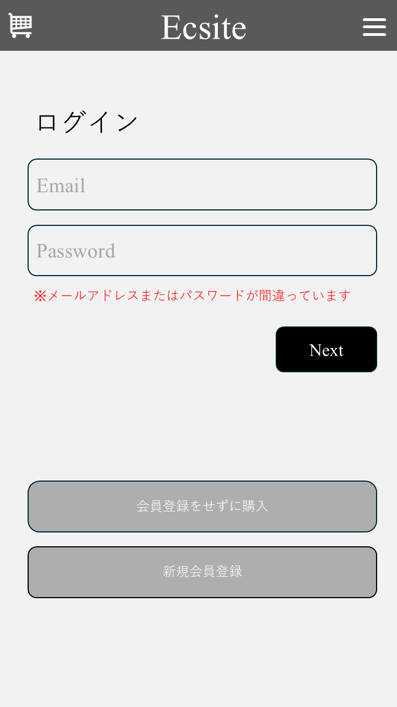

**S005　ログイン完了画面**
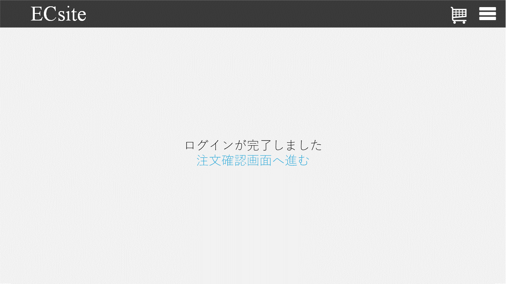
**S006　購入者情報入力画面**
PC
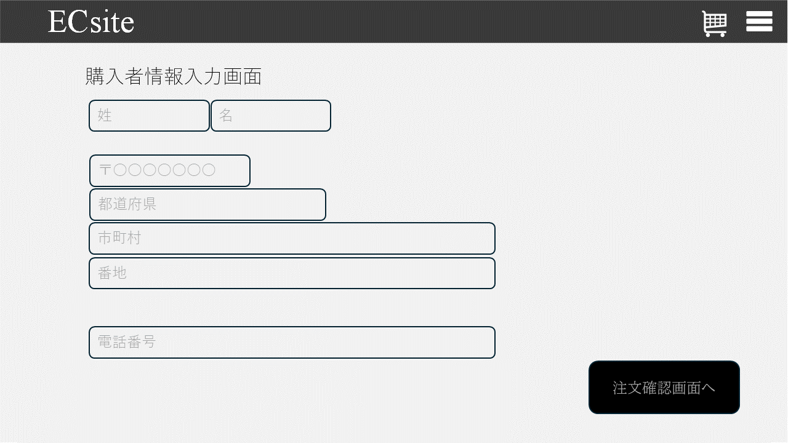
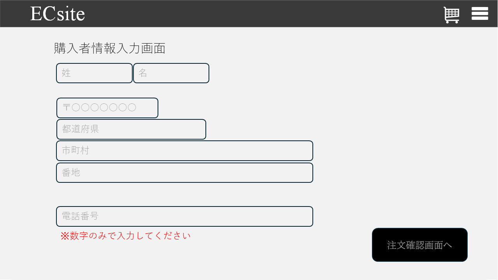
スマホ
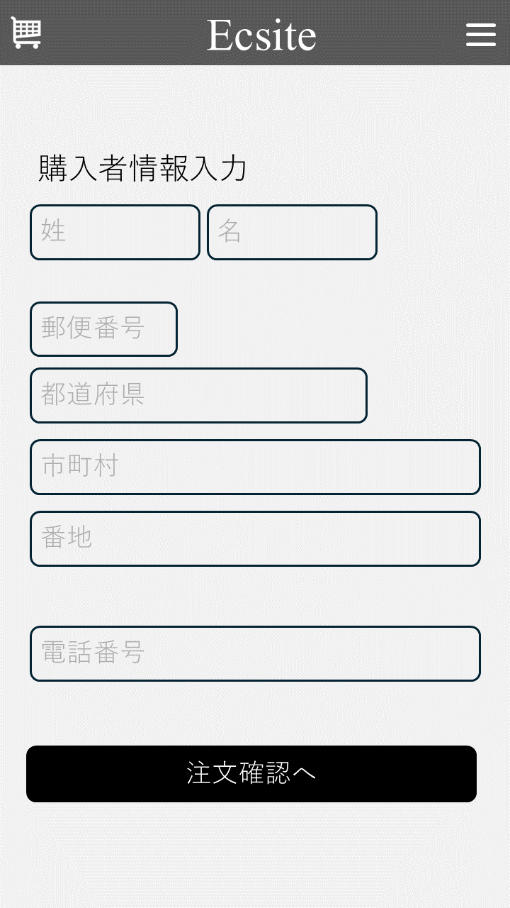


**S007　注文確認画面**
PC
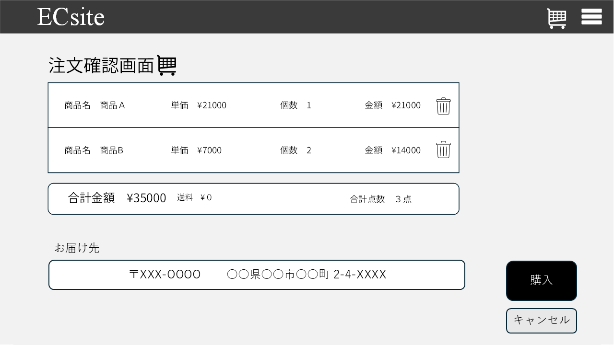

**S008　購入完了画面**
PC
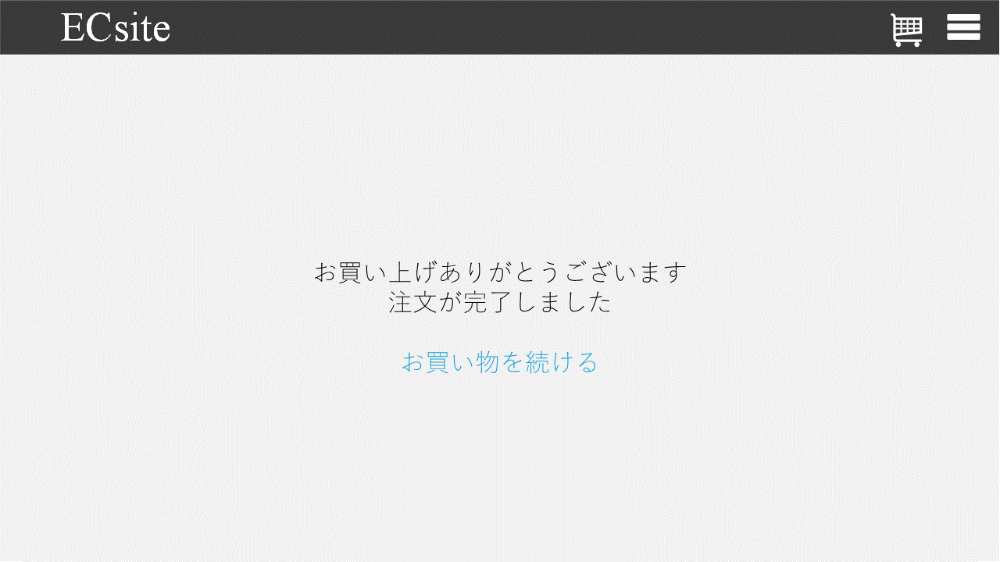

スマホ
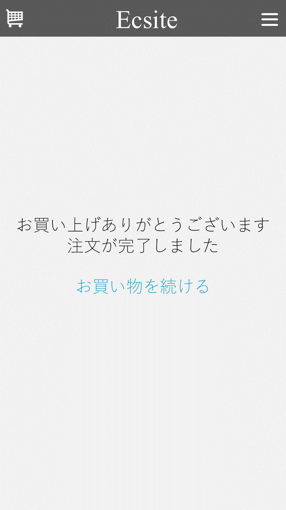
**S009　会員登録画面**
PC

スマホ


**S010登録完了画面**
PC

スマホ


### 7.2 バリデーション

####  入力チェック仕様 - 判定網羅表
 
#### 名前（Name）

| 条件                         | 判定 | エラーメッセージ                  |
|------------------------------|------|-----------------------------------|
| 入力が空                     | NG   | この項目は必須です               |
| 文字数が50文字以下           | OK   | -                                 |
| 文字数が51文字以上           | NG   | 50文字以内で入力してください     |

---
 
#### メールアドレス（Email）
 
| 条件                                   | 判定 | エラーメッセージ                            |
|----------------------------------------|------|---------------------------------------------|
| 入力が空                               | NG   | この項目は必須です                         |
| `xxx@yyy.zzz` の形式で入力されている   | OK   | -                                           |
| 形式が不正（例：`abc.com`, `@test`)    | NG   | メールアドレスの形式が正しくありません     |
 
---
 
#### パスワード（Password）
 
| 条件                                     | 判定 | エラーメッセージ                            |
|------------------------------------------|------|---------------------------------------------|
| 入力が空                                 | NG   | この項目は必須です                         |
| 文字数が8文字以上                        | OK   | -                                           |
| 文字数が7文字以下                        | NG   | 8文字以上の英数字を含めてください           |
| 英字・数字が混在                         | OK   | -                                           |
| 英字のみ or 数字のみ                     | NG   | 英字と数字を組み合わせて入力してください   |
 
---
 

 
#### 電話番号（Phone Number）
 
| 条件                              | 判定 | エラーメッセージ                             |
|-----------------------------------|------|----------------------------------------------|
| 数字のみで構成されている          | OK   | -                                            |
| 数字以外が含まれている（例：-）   | NG   | 数字のみで入力してください                   |
| 桁数が10桁または11桁              | OK   | -                                            |
| 桁数が9桁以下、12桁以上            | NG   | 電話番号は10桁または11桁で入力してください   |
 
---
#### 郵便番号（Zip Code）

| 条件                                         | 判定 | エラーメッセージ                                             |
|----------------------------------------------|------|--------------------------------------------------------------|
| 入力が空                                     | NG   | この項目は必須です                                          |
| 数字のみで構成されている                     | OK   | -                                                            |
| 数字以外が含まれている（例：-、空白、文字） | NG   | 郵便番号は数字のみで入力してください                        |
| 桁数が7桁（例：1234567）                     | OK   | -                                                            |
| 桁数が7桁未満または7桁より多い               | NG   | 郵便番号は7桁の数字で入力してください                        |
| ハイフン形式を許可していないのに含まれる     | NG   | 郵便番号は7桁の数字で入力してください（ハイフン不要）       |

---
### 7.3 バリデーションフローチャート

#### 名前（Name）バリデーションフローチャート


```mermaid
flowchart TD
    A[入力あり？] -->|いいえ| B[「この項目は必須です」]
    A -->|はい| C[文字数は50文字以下？]
    C -->|はい| D[OK]
    C -->|いいえ| E[「50文字以内で入力してください」]
```
---
#### メールアドレスのバリデーションフローチャート
```mermaid
flowchart TD
    A[入力あり？] -->|いいえ| B[「この項目は必須です」]
    A -->|はい| C[メール形式が正しい？]
    C -->|はい| D[OK]
    C -->|いいえ| E[「メールアドレスの形式が正しくありません」]
```
---
#### パスワードのバリデーションフローチャート
```mermaid
flowchart TD
    A[入力あり？] -->|いいえ| B[「この項目は必須です」]
    A -->|はい| C[8文字以上？]
    C -->|いいえ| D[「8文字以上の英数字を含めてください」]
    C -->|はい| E[英字と数字を両方含む？]
    E -->|はい| F[OK]
    E -->|いいえ| G[「英字と数字を組み合わせて入力してください」]
```
---

#### 電話番号のバリデーションフローチャート
```mermaid
flowchart TD
    A[数字のみ？] -->|いいえ| B[「数字のみで入力してください」]
    A -->|はい| C[桁数は10桁または11桁？]
    C -->|はい| D[OK]
    C -->|いいえ| E[「電話番号は10桁または11桁で入力してください」]
```
---
#### 郵便番号のバリデーションフローチャート
```mermaid
flowchart TD
    A[入力あり？] -->|いいえ| B[「この項目は必須です」]
    A -->|はい| C[数字のみ？]
    C -->|いいえ| D[「郵便番号は数字のみで入力してください」]
    C -->|はい| E[桁数は7桁？]
    E -->|はい| F[OK]
    E -->|いいえ| G[「郵便番号は7桁の数字で入力してください」]
```
---
## 8 開発環境・非機能要件

### 8.1 開発環境・実行環境の詳細

#### サーバ構成（インフラ）

| 項目 | 内容 |
|------|------|
| 実行環境 | AWS（EC2 + RDS + S3 + CloudWatch） |
| OS | Amazon Linux 2 |
| Webサーバ | Nginx 1.24.0（リバースプロキシ + 静的ファイル配信） |
| アプリケーションサーバ | Spring Boot embedded（Tomcat 9.0系） |
| バックエンド言語 | Java 17（LTS対応） |
| ビルドツール | Gradle 8.x または Maven 3.9.x |
| フレームワーク | Spring Boot 3.2.x（Spring Security, Spring Data JPA 等） |
| DBMS | Amazon RDS（PostgreSQL 15.x） |
| キャッシュ | Redis 7.x（セッション管理、パフォーマンス向上用） |
| フロントエンド | Vue.js 3.x + Vite または React 18.x |
| コンテナ管理 | Docker（開発・CI/CD用）、本番はECS/EKSやApp Runner等を想定 |
| CI/CD | GitHub Actions / GitLab CI / AWS CodePipeline |
| ソース管理 | Git（GitHub Enterprise想定） |
| モニタリング | Amazon CloudWatch + Zabbix / Datadog |
| バージョン管理 | Semantic Versioning（例：v1.2.3）でタグ付け管理 |

---

### 8.2 非機能要件の具体的な実現方法

#### 8.2.1 セキュリティ対策

| 項目 | 実現方法 |
|------|----------|
| 通信の暗号化 | ACM による SSL 証明書を ALB に設定し HTTPS を強制 |
| 認証・認可 | Spring Security による JWT 認証（RBAC対応） |
| パスワード保護 | BCrypt によるハッシュ化保存（SALT自動生成） |
| セッション管理 | JWT + Redis によるステートレス構成 |
| CSRF/XSS対策 | CSRF トークン付与、CSP ヘッダー設定、入力値サニタイズ |
| 管理画面保護 | IPホワイトリスト + BASIC認証 + 管理者ロール（RBAC）で制御 |
| 入力値検証 | Bean Validation（@NotNull, @Email, @Size 等）で入力チェック |
| DB暗号化 | カラム単位で AES-256 による暗号化（KMSキー管理） |
| 脆弱性チェック | CIパイプラインに Trivy / OWASP Dependency-Check を統合 |
| ログ改ざん防止 | S3バージョニング + CloudTrail で監査証跡の改ざん防止 |

---

#### 8.2.2 パフォーマンス対策

| 項目 | 実現方法 |
|------|----------|
| キャッシュ | Redis によるセッション/データキャッシュ、CloudFront で画像/CDN配信 |
| DBチューニング | インデックス最適化、N+1回避、スロークエリログ監視 |
| 非同期処理 | Spring Async / AWS SQS によるバックグラウンド処理実装 |
| フロント最適化 | Vite + WebP画像 + Lazy Load / Tree Shaking |
| スケーラビリティ | ECS オートスケーリング + RDS Multi-AZ 構成 |
| コネクションプール | HikariCP による DB接続プール（最大接続数調整） |
| APIモニタリング | Datadog APM によるレスポンス時間・スループット分析 |

---

#### 8.2.3 可用性・バックアップ

| 項目 | 実現方法 |
|------|----------|
| 可用性 | AWS マルチAZ構成（EC2/ECS + RDS） |
| DBバックアップ | RDS の自動スナップショット（毎日 AM2:00 / 保持30日） |
| 画像バックアップ | S3 のバージョニング + ライフサイクルポリシーで保持管理 |
| アプリケーション | Git によるリリースタグ管理、CI/CD によるデプロイ履歴保持 |
| セッション耐障害性 | Redis クラスタ構成 or ElastiCache Multi-AZ を利用 |
| 復旧訓練 | DR演習（四半期ごとにリストアテストを実施） |
| メンテナンス対応 | 「メンテナンス中」画面表示機能（メンテナンスバナー切替） |

---

### 8.3 監視設計方針

#### 8.3.1 監視項目一覧

| カテゴリ | 内容 |
|----------|------|
| サーバーリソース | CPU、メモリ、ディスクI/O、ネットワーク帯域使用量 |
| プロセス監視 | Nginx / Spring Boot / PostgreSQL プロセスの死活監視 |
| サービス監視 | HTTP/HTTPS 応答監視（ステータスコード監視） |
| ログ監視 | ERROR レベル以上のログをリアルタイム検知 |
| DB監視（拡張） | スロークエリ数、接続数、応答時間、レプリケーション遅延など |
| アプリケーション監視 | 注文数、ログイン失敗数、カート放棄率（カスタムメトリクス） |
| 異常検知 | Datadog Watchdog / AWS DevOps Guru によるML型異常検出 |

#### 8.3.2 監視方法・通知手段

| 項目 | 内容 |
|------|------|
| 使用ツール | Amazon CloudWatch / Zabbix / Datadog / Prometheus + Grafana |
| 通知手段 | Slack / Chatwork / メールアラート |
| 監視間隔 | 通常：1分間隔／重要サービス：30秒／リソース：5分集計 |
| 検知方式 | 閾値超過・異常パターン発生時に自動通知（応答遅延、連続エラーなど） |
| 死活監視 | HTTP 200 応答未検知で即時アラート |
| ログ監視設定 | CloudWatch Agent によるログ tail 継続監視（ローテーション後も有効） |

---

### 8.4 バックアップ・リストア手順概要

#### 8.4.1 バックアップ方針

| 項目 | 内容 |
|------|------|
| DB | RDS の自動スナップショット（毎日2:00 / 保持30日） |
| 画像データ | S3 のバージョニング有効化 + 定期同期で保持 |
| アプリケーション | Git タグ + CI/CD によるバージョン復元可能な状態を維持 |
| ログ | CloudWatch Logs / Datadog Logs に3ヶ月保管（分析・トレーシング用途） |

---

#### 8.4.2 リストア手順（概要）

#### DB リストア手順
1. AWS RDS 管理コンソールにログイン  
2. 対象スナップショットを選択し「復元」を実行  
3. 新インスタンス名を指定して復元開始  
4. アプリ設定（`application.yml` 等）を更新し再デプロイ  

#### S3 画像復旧手順
1. S3 管理画面で対象オブジェクトを選択  
2. 「バージョン履歴」からリストア対象を選択  
3. 復元を実行（上書きまたは別名復元）  

#### アプリケーション復旧手順
1. GitHub リポジトリから過去のタグをチェックアウト  
2. CI/CD パイプラインで再ビルド・再デプロイ実施  
3. 本番環境で動作確認・疎通テストを実行  

#### ログ確認（障害解析）
- CloudWatch Logs / Datadog Logs で該当時間帯のログを確認  
- リクエストID / ユーザーID でエラートレースが可能  

---


 

 
 